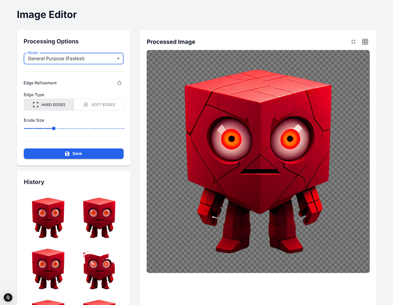

# Image Processing & Spritesheet Generator

A tool that processes images by removing backgrounds, compressing them, and combining them into spritesheets. Available both as a command-line tool and a web interface.



## Features

- 🎨 Automatic background removal
- 🗜️ Configurable image compression
- 🎯 Transparent pixel handling
- 📦 Automatic spritesheet generation
- 🌐 Web interface with live preview
- 💾 Processing history tracking

## Installation

1. Clone this repository
2. Install the required dependencies:
```
    pip install opencv-python-headless numpy rembg streamlit pillow tqdm
```

## Usage

### Web Interface

Run the web interface with:

```
    streamlit run app.py
```

Then:
1. Open your browser to the displayed URL
2. Upload your images
3. Adjust compression settings
4. Click "Process Images" to generate your spritesheet

### Command Line

Process images from the command line:

```
    python compress.py input_directory output_directory [-r RATIO] [-a]
```

Arguments:
- `input_directory`: Folder containing your source images
- `output_directory`: Where to save processed images
- `-r, --ratio`: Compression ratio (default: 8)
- `-a, --allow-transparent`: Enable transparent pixel handling

## Configuration

Key settings you can adjust:
- Compression ratio (2-16)
- Transparency handling
- Alpha threshold (50 by default)
- Visibility ratio (0.5 by default)

## Supported Formats

Input formats:
- PNG
- JPG/JPEG

Output format:
- PNG (with transparency support)

## How It Works

1. **Background Removal**: Uses the `rembg` library to remove image backgrounds
2. **Compression**: Reduces image size by combining pixel blocks using median values
3. **Spritesheet Generation**: Combines processed images horizontally into a single spritesheet

## Requirements

- Python 3.6+
- See `requirements.txt` for full dependency list

## License

MIT License

Copyright (c) 2024 astrimbu

Permission is hereby granted, free of charge, to any person obtaining a copy
of this software and associated documentation files (the "Software"), to deal
in the Software without restriction, including without limitation the rights
to use, copy, modify, merge, publish, distribute, sublicense, and/or sell
copies of the Software, and to permit persons to whom the Software is
furnished to do so, subject to the following conditions:

The above copyright notice and this permission notice shall be included in all
copies or substantial portions of the Software.

THE SOFTWARE IS PROVIDED "AS IS", WITHOUT WARRANTY OF ANY KIND, EXPRESS OR
IMPLIED, INCLUDING BUT NOT LIMITED TO THE WARRANTIES OF MERCHANTABILITY,
FITNESS FOR A PARTICULAR PURPOSE AND NONINFRINGEMENT. IN NO EVENT SHALL THE
AUTHORS OR COPYRIGHT HOLDERS BE LIABLE FOR ANY CLAIM, DAMAGES OR OTHER
LIABILITY, WHETHER IN AN ACTION OF CONTRACT, TORT OR OTHERWISE, ARISING FROM,
OUT OF OR IN CONNECTION WITH THE SOFTWARE OR THE USE OR OTHER DEALINGS IN THE
SOFTWARE.

## Contributing

Contributions are welcome! Please feel free to submit a Pull Request.

## Acknowledgments

Special thanks to [Tobias Fischer](https://github.com/tobias17) for the original [python script](https://github.com/tobias17/sd-pixel-anims/blob/master/compress.py) that this project builds upon.
